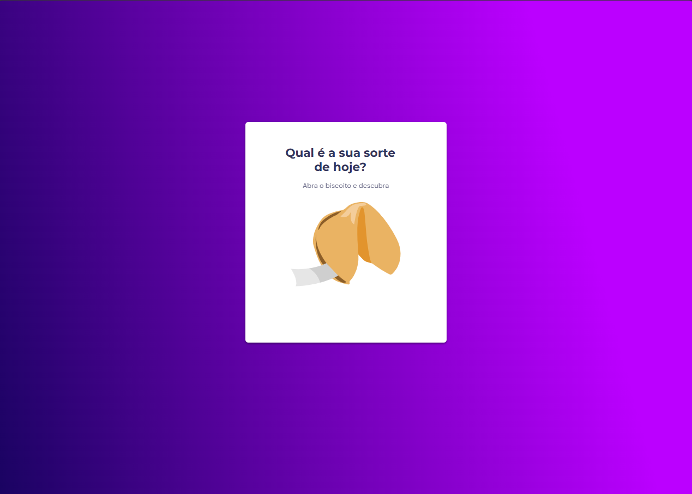
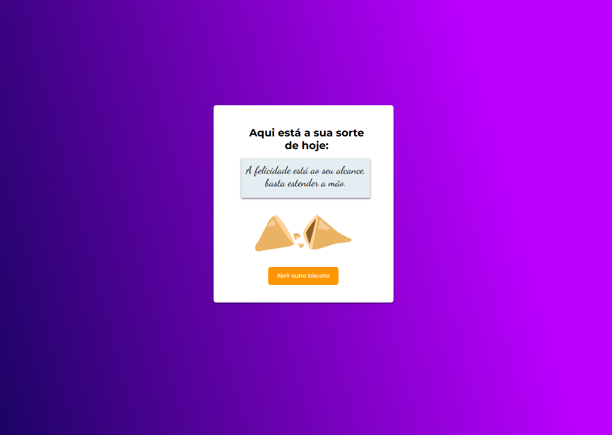

<strong><h1 align="center">Biscoito da Sorte</h1></strong>

  Biscoito da Sorte é um jogo simples desenvolvido com HTML, CSS e JavaScript. O usuário clica em um biscoito da sorte para revelar uma mensagem de sorte do dia. A interface é composta por duas telas e o jogo inclui animações suaves para melhorar a experiência do usuário.

  
  

## 🚀 Tecnologias

Esse projeto foi desenvolvido com as seguintes tecnologias:

- HTML
- CSS
- JavaScript
---

## 🚀 Funcionalidades

- Animação ao passar o cursor sobre o biscoito da sorte.
- Animação de entrada do card de mensagem de sorte.
- Transição suave entre as telas de jogo.
- Mensagens de sorte geradas aleatoriamente a cada vez que o biscoito é aberto.

Feito com ♥ 